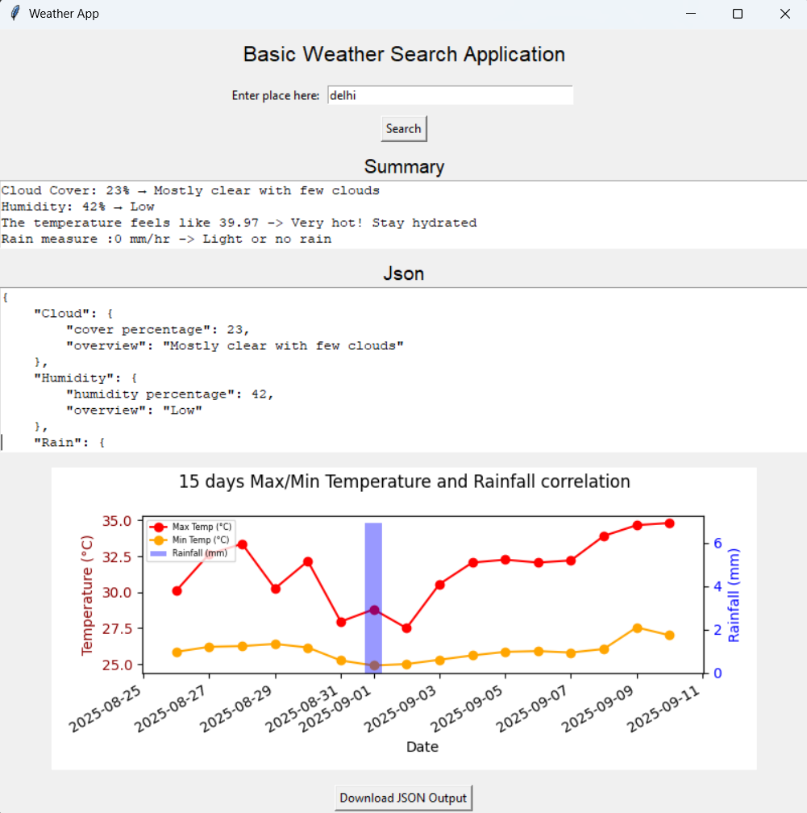
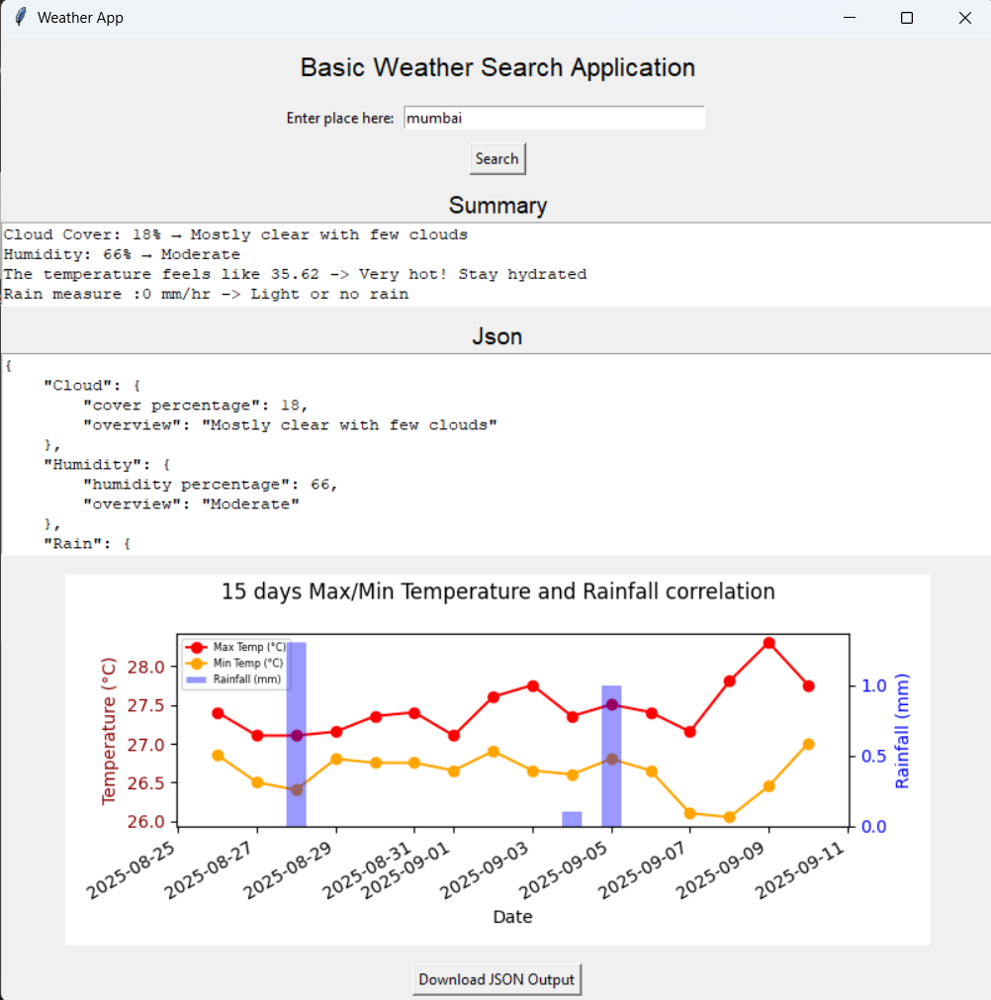

# Weather App (Tkinter + OpenWeather + OpenMeteo)

A simple Python desktop application to get **current and historical
weather** data for any location using:

-   **OpenWeatherMap API** (for current weather)
-   **Open-Meteo API** (for historical data trends)
-   Built with **Tkinter** and **Matplotlib** for GUI and visualization
-   Supports **JSON export** and graphical display of past temperature
    and rainfall

------------------------------------------------------------------------

## App Features

-   Search weather by place name
-   Displays:
    -   Cloud cover
    -   Humidity
    -   Max, Min, and Feels-like temperature
    -   Rain (mm/hr)
-   Plots 15-day historical temperature and rainfall
-   Export JSON weather data
-   Built with Python, no heavy external dependencies

------------------------------------------------------------------------

## Output Screenshot





------------------------------------------------------------------------

## Requirements

Python 3.8+ Required.

Install required packages:

``` bash
pip install -r requirements.txt
```

------------------------------------------------------------------------

## API Key Setup

1.  Sign up and get a **free API key** from
    [OpenWeatherMap](https://openweathermap.org/api).

2.  Create a `.env` file in the root of your project:

    ``` env
    API_KEY=your_api_key_here
    ```

3.  The app will read this key using `python-dotenv`.

------------------------------------------------------------------------

## How to Run

1.  Clone this repo:

    ``` bash
    git clone https://github.com/LN-simhan/weather-app.git
    cd weather-app
    ```

2.  (Optional) Create and activate a virtual environment:

    ``` bash
    python -m venv venv
    source venv/bin/activate  # Linux/macOS
    venv\Scripts\activate     # Windows
    ```

3.  Install dependencies:

    ``` bash
    pip install -r requirements.txt
    ```

4.  Run the app:

    ``` bash
    python app.py
    ```


------------------------------------------------------------------------

## Project Structure

    weather-app/
    │
    ├── app.py                  # Main application code
    ├── requirements.txt        # Required dependencies
    ├── .env                    # API key (To be created)
    ├── README.md               # This file
    └── output/
        │
        ├── data.json               # Current weather data retrieved from API
        └── weather_data.json       # (Will be generated if downloaded) Sample Output file 


------------------------------------------------------------------------

## Tech Stack

-   Python 3.x
-   Tkinter (GUI)
-   Matplotlib (plots)
-   OpenWeatherMap API
-   Open-Meteo API
-   pandas, requests, dotenv

------------------------------------------------------------------------

## Notes & Limitations

-   Place lookup is done using [Photon
    (Komoot)](https://photon.komoot.io/)
-   Open-Meteo provides free historical weather without API keys. (Free for non-commercial use with rate limiting)
-   Rainfall and temperature data is approximate for the given
    coordinates


------------------------------------------------------------------------

## License

This project is open-source and free to use under the MIT License.
